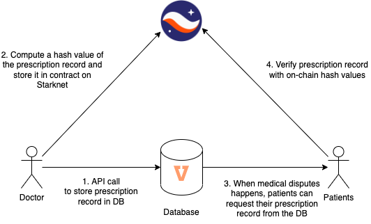

<!-- logo -->

  

<!-- tag line -->
<h1 align='center'>StarkMed</h1>
<h3 align='center'>On-chain Verification of Medical Records</h3>

<!-- primary badges -->

  

## Why❔

Most medical records is stored in centralised database of healthcare institutes. These data can be falsified when medical disputes arise. With low-cost computation and high TPS enabled by StarkNet, it is a perfect platform to record proofs of medical procedures on-chain. 

## 👨‍🔧🛠

  

## Demo Link 🔗
https://starknet-hackathon.vercel.app/
Please use our private key: `0x048619c774fafbcd0ad10f292fc4f32e5c4983bba87f40fee524b0d6475aaa84`

## Demo Video 📹

## Future experiments 🧪
We think we are just scratching the surface of what StarkNet and Cairo are possible to achieve.
- Use SHARP prover for Zero-Knwoledge Machine Learning of medical data
- 

## How to use❔
Please find the instructions in `README.md `in `starknet`, `frontend` and `backend` folders.

## Special Thanks ❤️

Special thanks to:

Michael Fung ([@michael-vascue](https://github.com/michael-vascue)) from [Vascue](https://github.com/vascue-io)

and of course the [Athos Finance](https://athos.finance/) team for their dedicated support!
